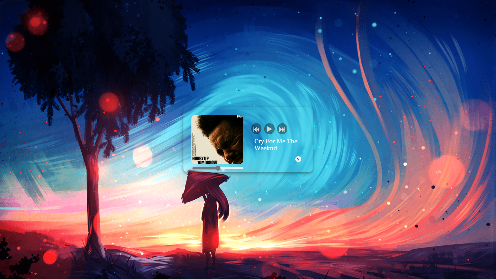
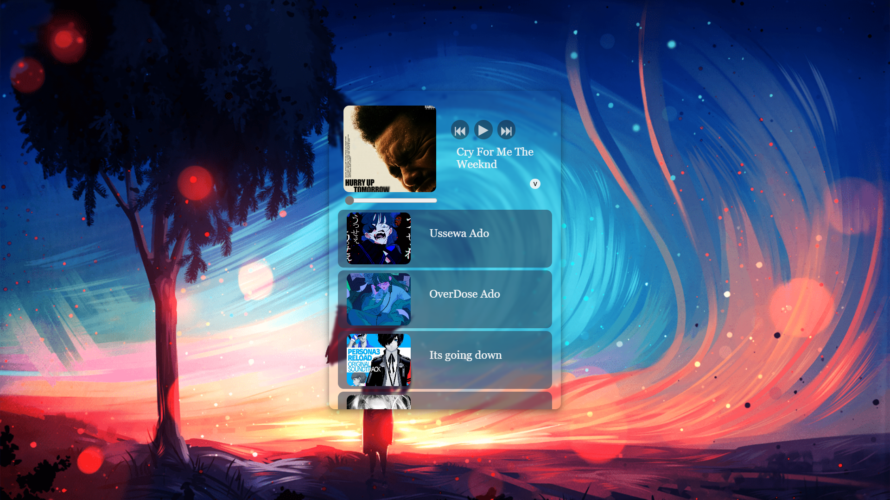
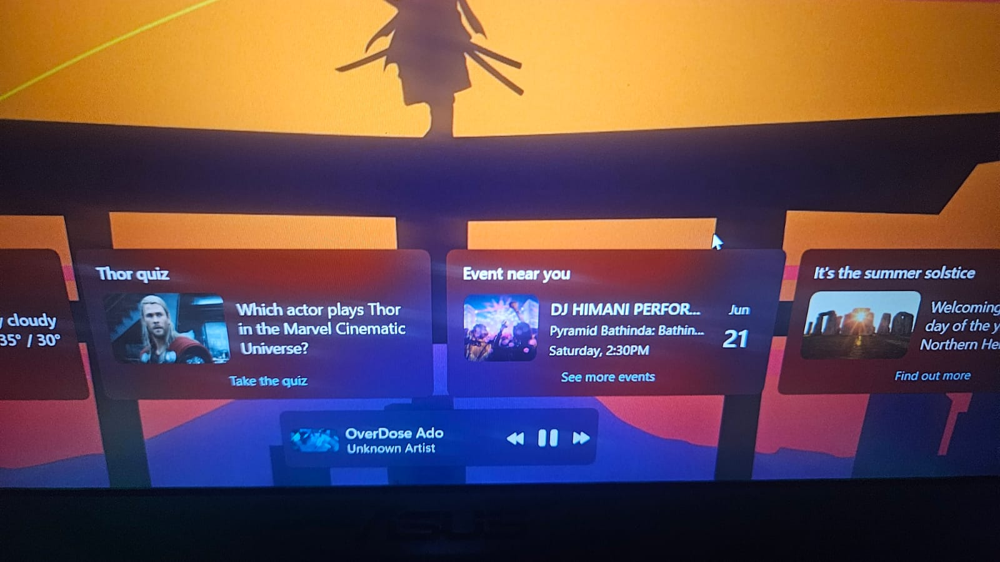

# 🎵 JavaScript Media Player

A responsive and feature-rich **web-based audio player** built using **HTML, CSS, and JavaScript**.  
It supports a dynamic playlist, interactive UI, and modern browser integrations via the **Media Session API**.

---

## 🔥 Features

- ▶️ **Play / Pause / Seek** controls
- ⏮️⏭️ **Previous / Next track navigation**
- 🔊 **Media Session API** support:
  - Shows current track info on lock screen
  - Supports media keys on keyboards and headsets
- 🎛️ Interactive **seek bar**
- 📱 **Responsive layout** for mobile and desktop
- ⬆️ Collapsible playlist UI
- 📦 Easy to plug in your own music and images

---

## 📸 Demo

### 🎬 Video Preview  
[📹 Watch the demo](./video-demo/Demo.mp4)

### 🖼️ Screenshots  

---

### 🔒 Lock Screen Media Controls (Media Session API in Action)

This project integrates the [Media Session API](https://developer.mozilla.org/en-US/docs/Web/API/Media_Session_API) to enhance the listening experience beyond the browser:

- Control playback from the lock screen or media keys
- Display metadata like title, artist, and artwork

---

⚠️ Important Note
This project does not include any audio or image files due to copyright restrictions.
You must add your own media files in the assets/ folder to make the player fully functional.

---

## 💡 Technologies Used

- HTML5
- CSS3
- Vanilla JavaScript
- [Media Session API](https://developer.mozilla.org/en-US/docs/Web/API/Media_Session_API)

---